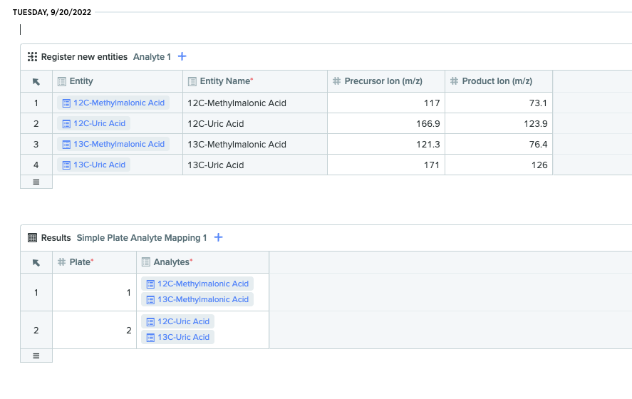

```{r}
has_credentials <- Sys.getenv("BENCHLING_DEV_WAREHOUSE_USERNAME")
if (has_credentials == "") {
  has_credentials <- FALSE
} else {
  has_credentials <- TRUE
}
```

```{r, include = FALSE}
knitr::opts_chunk$set(
  collapse = TRUE,
  comment = "#>"
)
```

```{r setup}
library(benchlingr)
library(magrittr)
```


Benchling R&D Cloud is a laboratory information management system with a [developer platform](https://docs.benchling.com/docs) consisting of a Postgres database, an application programming interface (API), an "Events" system that is built on top of the AWS EventBridge service, as well as a Python software development kit (SDK). `benchlingr` is an unofficial R package that aims to make the Benchling developer platform accessible to data scientists using R. 


# Installation

Install the `benchlingr` package from GitHub using the `remotes` package. 

```{r, eval=FALSE}
remotes::install_github("hemoshear/benchlingr")
```

The `benchlingr` package also requires Python. We recommend using the [Anaconda distribution](https://www.anaconda.com/products/distribution)

# Configuration

The `benchlingr` package primarily utilizes the RESTFUL API service and Postgres database components of the Benchling developer platform. In order to use these components of the Benchling platform, one must acquire API keys and database credentials through the Benchling interface. This section will focus on how to make these credentials available to the `benchlingr` package. 

## API

In order to access the Benchling API service on one's Benchling tenant, one must obtain an API key through the Benchling interface. [Follow the instructions in the official documentation](https://help.benchling.com/en/articles/2353570-access-the-benchling-developer-platform-enterprise) to obtain an API key. After obtaining an API key, it is recommended that you define a variable in `.Renviron` called `BENCHLING_API_KEY` to make this key accessible to the `benchlingr` package with the default function arguments. 

```
# ~/.Renviron

# Benchling API key
BENCHLING_API_KEY=xxxxxxxxxxx
```

## Data warehouse

[Follow the instructions in the official documentation](https://docs.benchling.com/docs/getting-started#obtaining-credentials) to obtain a username and password for the data warehouse for your Benchling tenant. After obtaining a username and password, it is recommended that one define a variable in `.Renviron` called `BENCHLING_WAREHOUSE_KEY` and `BENCHLING_WAREHOUSE_PASSWORD` to make the credentials available to `benchlingr` with the default function arguments. 

```
# ~/.Renviron
# Benchling API key
BENCHLING_API_KEY=xxxxxxxxxxx

# Benchling warehouse credentials
BENCHLING_WAREHOUSE_USERNAME=yyyyyyyyyyy
BENCHLING_WAREHOUSE_PASSWORD=xxxxxxxxxxx
```

## Python SDK

The `benchlingr` R package uses the official Benchling Python SDK to access the Benchling API service. The Python dependencies will be installed automatically into a `miniconda` environment. One can also create new `conda` or `virtualenv` environments with the `config_sdk_env` helper function, which simply creates an environment and installs the `benchling-sdk` package in it. 

```{r, eval=FALSE}
config_sdk_env()
```

See the [official Anaconda documentation](linkhere) for instructions on how to install Anaconda on your machine.

# Fundamentals of the Benchling Data Warehouse

The Benchling data warehouse is a read-only, Postgres database that can be used to easily extract data pertaining to items such as the inventory, entities, results, and noteboook entries using SQL queries. Before moving on, we recommend that the user reads the [official Benchling documentation](https://docs.benchling.com/docs/getting-started) for the data warehouse. The rest of this section will assume the user has a basic understanding of Benchling's data warehouse, as we will discuss practical considerations of working with the database, including how to use `benchlingr` tools to streamline your interactions with the database. 

To connect to the data warehouse on your tenant with the `benchlingr` package, use the `warehouse_connect` function. By default, the function looks for two environment variables in `.Renviron`: `BENCHLING_WAREHOUSE_USERNAME` and `BENCHLING_WAREHOUSE_PASSWORD`. If this function is not working for you, please see the instructions for configuration in the  [official documentation](https://docs.benchling.com/docs/getting-started#warehouse-configuration). Once you are able to connect to the database using the instructions in the official tutorial, the `warehouse_connect` function should work properly, assuming that the aforementioned environment variables are set. 

```{r, eval=has_credentials}
conn <- warehouse_connect(tenant = "hemoshear-dev",
                          username = Sys.getenv("BENCHLING_DEV_WAREHOUSE_USERNAME"),
                          password = Sys.getenv("BENCHLING_DEV_WAREHOUSE_PASSWORD"))
class(conn)
```

The `warehouse_connect` function will return a Postgres SQL database connection object (`PqConnection`), which can be used to make queries against the database using the `DBI` package in R. To verify that you are connected to the database for your Benchling tenant, one can use the `dbIsValid` to display information about the connection itself. 

```{r, eval=has_credentials}
DBI::dbIsValid(conn)
```

The `DBI::dbDisconnect` function closes the warehouse connection. 

```{r, eval=has_credentials}
DBI::dbDisconnect(conn)
```

## "Raw" tables and Postgres views  

One can use the `DBI::dbListTables` function to see all the tables in the database. You'll notice that every "table" in the database is actually comprised of two tables: an unedited version of the data, referred to as the "raw" table, and a cleaned up Postgres view of the data. For example, the `analyte` table is the Postgres view for a custom entity schema we defined, and the `analyte$raw` table is unedited table. 

```{r, eval=has_credentials}
conn <- warehouse_connect(
  tenant = "hemoshear-dev",
  username = Sys.getenv("BENCHLING_DEV_WAREHOUSE_USERNAME"),
  password = Sys.getenv("BENCHLING_DEV_WAREHOUSE_PASSWORD"))
DBI::dbListTables(conn)[1:6]
```

In general, the Postgres views are more convenient to work with, since the raw tables contain many Benchling identifiers intended for internal use. In our experience, however, there are some use cases where the raw tables should be accessed instead of the Postgres views. For example, when one needs to extract assay results submitted in notebook entries that have not been approved, one will need to use the "raw" tables to do so, since the Postgres views will not contain assay results from unreviewed notebooks. Refer to the [official Benchling documentation](https://docs.benchling.com/docs/warehouse-columns-rows-descriptions#the-benchling-warehouse-columns-descriptions) for more information about the differences between the raw tables and the Postgres views.  


## Retrieving data from the warehouse  

To retrieve data from a table in the data warehouse, one can use the `DBI::dbGetQuery` function. The data warehouse consists of several types of tables, each with a different set of base columns. 

For example, here is the code one would use to retrieve all the notebook entries from the data warehouse. Take a moment to look at the results of this query, as well as the [descriptions of the columns in the official Benchling documentation](https://docs.benchling.com/docs/warehouse-columns-rows-descriptions). The 

- 

```{r, eval=has_credentials}
DBI::dbGetQuery(conn, "SELECT * FROM entry") %>%
  tail()
```


### Custom entities

The data warehouse for your tenant will come pre-loaded with tables relevant to any entity schemas that are universal to the Benchling system. For example, the `entry` schema is available on every Benchling installation with ELN functionality. Other tables are created when new schemas are defined in Benchling. When a custom entity or result schema is defined, Benchling creates a new set of tables in the database: one for the Postgres view and one for the raw data. For example, we defined a custom entity schema for representing analytes. 

{width=85%}
---

When we defined the "Analyte" custom entity schema, Benchling created a table in the data warehouse called `analyte`. All the analyte entities we created can be retrieved with `DBI::dbGetQuery`. 

```{r, eval=has_credentials}
DBI::dbGetQuery(conn, 
  "SELECT schema,id,name$,precursor_ion_mz,product_ion_mz FROM analyte") %>%
  head()
```

Benchling also created a "raw" table for our custom analyte schema.

```{r, eval=FALSE}
DBI::dbGetQuery(conn, 
  "SELECT id,schema,precursor_ion_mz,product_ion_mz,assay FROM analyte$raw") %>%
  head()
```


`schema`, `id`, and `name$` are important fields present in every entity warehouse table. The `schema` field is the system name of the schema, which is necessary for some of the critical functionality in `benchlingr`. The `id` field is the Benchling identifier for the entity. The identifier for a custom entity will always start with `bfi_`, but other built-in Benchling entities will have specific prefixes in their identifiers. For example, `container` is a built-in Benchling entity schema and the identifiers for containers start with `con_`. Finally, `name$` is the name for the entity. Typically the name is human-friendly, but there are several ways an entity can be named depending on how the schema is configured. 

In addition to `schema`, `id`, and `name$`, there are many other columns present in every entity table. Read more about the other columns in the [Benchling documentation](https://docs.benchling.com/docs/warehouse-columns-rows-descriptions#example-entity-table). 

Finally, the warehouse table for a custom entity will contain a column for every user-defined field in the entity. In our "analyte" example, each analyte entity can have a precursor ion m/z and a product ion m/z, which are representing as floats or "decimals" using the Benchling terminology. 


### Results

Similar to entities, every results schema in Benchling is represented as a table in the data warehouse. There are several differences between representations of results and entities worth mentioning. 

First, results do not have names, but entities do. Second, both results and entities have identifiers, but entity identifiers tend to be more useful, since many operations involve finding results through entities linked to them, and not necessarily finding results directly via the identifier. 

Third, when entities are registered, they become available in the Postgres view in the data warehouse shortly after (Benchling always has a short delay for data to be exported to the warehouse). When results are submitted, they are *not* available in the Postgres view in the data warehouse, but they are available in the "raw" table. Results only become available in the Postgres view after the notebook entry is reviewed. For that reason, the "raw" tables for results typically need to be accessed more frequently than the "raw" tables for entities, especially if notebook entries are not always being reviewed before the data contained within must be accessed. 

Finally, results are linked to particular notebook entries in the data warehouse, but entities are not. In other words, a warehouse table for a results schema will have a column for a notebook entry identifier, but an entity table will not have a column for notebook entry identifier. 

Shown below is a screenshot of a results table in a notebook entry with a schema called "Simple Plate Analyte Mapping". This is a result schema with two fields: "Plate" and "Analytes". The "Plate" field is an integer type that serves as a loose identifier for an assay plate, and the "Analytes" field is a custom entity type "Analyte" that we discussed in the previous section. The "Analytes" field can also take on multiple values. 


To extract this data from the warehouse, use the `DBI::dbGetQuery` function. In this case, I use the identifier for the notebook entry to extract all results of the `simple_plate_analyte_mapping` schema. I'm looking in the "raw" table because the notebook entry with this table has not been reviewed yet. 

```{r, eval=has_credentials}
DBI::dbGetQuery(conn, 
  "SELECT * FROM simple_plate_analyte_mapping$raw WHERE entry_id$ = 'etr_MWQ7M7Pz'")
```


Many of the columns in the "raw" tables should not be used in any context, such as `_pkey` and `_sync_key`, because they are internal identifiers for Benchling. It is important to also extract the `$archived$` column to see whether or not results are archived, as well as the `schema` column so that you may use `benchlingr` tools to pull information about entity fields in the results. 


```{r, eval=has_credentials}
df <- DBI::dbGetQuery(conn, 
  "SELECT schema,archived$,plate,analytes FROM simple_plate_analyte_mapping$raw 
  WHERE entry_id$ = 'etr_MWQ7M7Pz'")
```

### Multi-select columns

Fields in entities and results can be configured such that multiple values can be submitted. These "multi-select" columns are represented as JSON objects in the data warehouse. To unpack the values in these columns to create new rows or columns in the data frame, use the `expand_multiselect_column` function. 

To unpack the value such that the original row is copied for each value in the multi-select column, use the `shape="long"` argument. 

```{r, eval=has_credentials}
expand_multiselect_column(conn, df, column="analytes", shape="long")
```

To unpack the value into new columns in the original row, use the `shape="wide"` argument. By default, the new columns are named by appending a number to the original column name ($(1, 2, ..., n)$, where n is the maximum number of elements that appear in a value within the multi-select field). When the using the `"wide"` argument, the original column of `pq_jsonb` type is stored in the data frame. 

```{r, eval=has_credentials}
expand_multiselect_column(conn, df, column="analytes", shape="wide")
```
### Entities

In a data warehouse table, entity links are represented as identifiers. In the example below, "analytes" is a custom-entity column, so all the identifiers start with "bfi_".  

```{r, eval=has_credentials}
res <- expand_multiselect_column(conn, df, column="analytes", shape="long")
res
```

With the `benchlingr` package, you can easily pull additional information about entities in a table without writing more SQL. The `get_entity_table` function will take a warehouse table as input and return information about the entities contained within the table. 

In this example, we have a results table in which four distinct "analyte" entities appear. The `get_entity_table` will look in the correct warehouse table (`analyte`) for the rows that correspond to the identifiers in our data. The function also takes an argument called `columns` that allows one to choose which entity columns to pull information for. In the absence of a `columns` argument, the function will try to pull information for all entity columns in the table.

```{r, eval=has_credentials}
get_entity_table(conn, res, columns = "analytes")
```
The `replace_entity_id_with_name` function will simply replace the Benchling identifiers with the names of the entities. 
```{r, eval=has_credentials}
analytes <- replace_entity_id_with_name(conn, res)
analytes
```


The function will not work properly for data frames in which a multi-select, entity column is expanded using the `shape='wide'` argument with the `expand_multiselect_column` function. If you need to replace identifiers of a multi-select, entity column, then it is best to use the `replace_entity_id_with_name` function *before* calling `expand_multiselect_column`. 

```{r, eval=has_credentials}
head(df)
res <- replace_entity_id_with_name(conn, df)
res <- expand_multiselect_column(conn, res, column="analytes", shape="wide")
head(res)
```


# Accessing the Benchling API via the Python SDK in R. 

To create an interface to the Benchling API, use the `benchling_api_auth` function after you have set the `BENCHLING_API_KEY` environment variable as described in the Python SDK configuration section. 

```{r, eval=has_credentials}
client <- benchling_api_auth(
  tenant="https://hemoshear-dev.benchling.com",
  api_key=Sys.getenv("BENCHLING_DEV_API_KEY"))
```

The `benchling_api_auth` function returns the [facade object](https://benchling.com/sdk-docs/benchling_sdk.benchling.html) from the Benchling Python SDK that facilitates interaction with the API. Most of the attributes of the facade object are the [services in the Benchling API documentation](https://benchling.com/api/reference). 


```{r, eval=has_credentials}
head(names(client))
```

Each service will have multiple methods available. 

```{r, eval=has_credentials}
names(client$entries)
```

# Notebook Entries

Notebook entries can be found in the `entry` table in the data warehouse. Note, this table contains some of the notebook entry metadata, but not the content of the entry itself.

```{r, eval=has_credentials}
conn <- warehouse_connect(
  "hemoshear-dev",
  username = Sys.getenv("BENCHLING_DEV_WAREHOUSE_USERNAME"),
  password = Sys.getenv("BENCHLING_DEV_WAREHOUSE_PASSWORD"))
DBI::dbGetQuery(conn, 
  "SELECT id,display_id,schema_id,entry_template_id,review_status FROM entry") %>%
  head()
```

The content of the notebook entries (aside from results and entities), must be retrieved from the API. To retrieve a notebook entry, use the `entries$get_entry_by_id` method. The method takes the ID of an entry as an argument, which starts with `etr_`. 

```{r, eval=has_credentials}
entry <- client$entries$get_entry_by_id("etr_T3WZTyAe")
```

```{r, eval=has_credentials}
class(entry)
```


## Reading unstructured tables.  

Benchling users can record information in unstructured tables within notebook entries. 


----


The `read_entry_tables` function extracts all unstructured tables in a notebook entry, and returns them as a list of data frames for further processing in R. 

```{r, eval=has_credentials}
tables <- read_entry_tables(entry)
tables[[1]]
```


## Reading plate diagrams.  

In addition to unstructured tables, Benchling users can create "plate diagrams" to describe the contents of physical plates. The plate diagram tables can only be certain sizes (2x3, 3x4, 4x6, 6x8, 8x12, 16x24, and 32x48), the column names must be integers, and the row names must be letters. 


It is useful to convert these tables into long form for further processing in R. To do so, one can start with the `read_plate_diagrams` function instead of the `read_entry_tables` function. The `read_plate_diagrams` will extract the plate diagrams from the notebook entry and convert the output data frames into long form tables with three columns: `row`, `column`, and `content`. The `row` is a letter for the row on the plate, the `column` is an integer for the column on the plate, and `content` is the text that appears in the cell in the table. 

The names of the list will be the names of the tables in the notebook entry.  

```{r, eval=has_credentials}
entry <- client$entries$get_entry_by_id("etr_f1bpDIes")
diagrams <- read_plate_diagrams(entry)
str(diagrams)
head(diagrams$Well1)
```

## Schemas within notebook entries  

Both entities and results can be created in tables within notebook entries. A data analyst will need to query a specific API endpoint or warehouse table to find the registered entities or results, so one needs to know the schema associated with the entity or results table. The Benchling user can change the name displayed for the tables in the notebook entry, so it is not always obvious which schemas are present in the notebook entry. Furthermore, if the data will be extracted from the warehouse, we'll need to know the names of the warehouse tables to query, which cannot always be inferred from the schema names alone. 

For example, suppose you want to know the schemas of the tables in this notebook entry:



The `list_schemas_in_entry` function returns a table with the names of the results and entity schemas contained within the notebook entry. The `name` and `system_name` fields are helpful because they tell you where to look in the Benchling GUI and the data warehouse, respectively. 

```{r, eval=has_credentials}
entry <- client$entries$get_entry_by_id("etr_MWQ7M7Pz")
list_schemas_in_entry(client, conn, entry)
```


# Downloading attached files

Benchling users can attach files to results and entities, which are referred to as blobs.

  

----

The schema name for this example table is `simple_plate_analyte_mapping`, so we can query the table to get the identifiers and file names for the blobs to download. In this case, we use the entry identifier to filter the table down to the results we actually care about, but one could filter the table in various ways (ex. creation time). 

```{r, eval=has_credentials}
d <- DBI::dbGetQuery(conn, 
  "SELECT plate,analytes,file FROM simple_plate_analyte_mapping$raw 
  WHERE entry_id$ = 'etr_JYUlMiIs'")
d
```

Each "blob" consists of an identifier, a URL, and a name. `download_blobs` is a low-level wrapper for the Python SDK that downloads a set of blobs from Benchling as specified by their ID and file name. 

```{r, eval=FALSE}
download_blobs(
  client, 
  file_map = list(
    "ff0cca5f-b400-4e42-9df6-9f1badc4b7e2" = "Plate1-Data.csv",
    "a2ed3ec8-59b9-451a-81eb-c4fb5322858b" = "Plate2-Data.csv"),
  outdir='data')
```

The `download_blobs_in_warehouse_table` function will download all files attached to a particular set of columns in a warehouse table. By default, it will try to download files from all blob columns unless a specific set is passed to the `column` argument. The files in each column are saved to a subdirectory within `outdir`. 

```{r, eval=FALSE}
download_blobs_in_warehouse_table(conn, d, column='file', outdir="data")
```


```{r, eval=FALSE, echo=FALSE}
library(ggplot2)
ggplot(diagrams$Plate1, aes(x=column, y=row, label=content)) +
  geom_tile() +
  geom_text() +
  theme(axis.text.x = element_text(position='top'))
ggplot2::text
```


